# Massive Data Processing - Assignment 1 - Madriss Seksaoui
<p align="center">
  
</p>
The objective of this assignment is to implment an inverted index in MapReduce.
Here are some basic informations of our Hadoop system:
```
4 cores CPU (64 bits) with 4 Go of RAM allocated in the virtualmachine

Hadoop 2.6.0-cdh5.8.0
Subversion http://github.com/cloudera/hadoop -r 57e7b8556919574d517e874abfb7ebe31a366c2b
Compiled by jenkins on 2016-06-16T19:38Z
Compiled with protoc 2.5.0
From source with checksum 9e99ecd28376acfd5f78c325dd939fed
This command was run using /usr/lib/hadoop/hadoop-common-2.6.0-cdh5.8.0.jar
```
First we need to create input and output directories in our Hadoop system: 
```
hadoop fs -mkdir input
hadoop fs -mkdir output
hadoop fs -put input
```
We can then check if the operation was successful:

```
hadoop fs -ls input
```

### Question a) Identification of stop words
A stop word is defined as a word with a frequency > 4000. This means that we need to use WordCount and add a condition on the frequency of the words in order to only account for stop words. Starting from the code provided by Stanford,  a condition on the number of occurences was added, as well as a way to remove duplicates by tranforming the words to their lowercase form.

```java
public void map(LongWritable key, Text value, Context context)
				throws IOException, InterruptedException {
			for (String token : value.toString().split("\\s+")) {//here we split each word
				word.set(token.toLowerCase()); // we set each token to its lower case form in order to avoid duplicates
				context.write(word, ONE);
        }
    }
```
The condition on the word frequency:
```java
if (count > 4000) { // condition for a stop word
				context.write(key, new IntWritable(count)); // we write the stop word with its count
			}
```
also, a line was added in order to get a csv file output.
To run our first hadoop job we open a terminal and execute the following command:

```
hadoop jar StopWords.jar edu.stanford.cs246.invertedindex.Ai input output
```
In order to get the final csv file we execute the following command in a terminal:

```
To run our first hadoop job we open a terminal and execute the following command:

```
hadoop jar StopWords.jar edu.stanford.cs246.invertedindex.Ai input output
```
hadoop fs -getmerge output result.csv
```
Here are the first lines of the obtained result:

```
about,7350
be,27239
before,4219
by,19509
her,24277
mr.,4742
much,4712
```
#### i) using 10 reducers and no combiners:
In order to set the number of reducers, one can use the following method `job.setNumReduceTasks(10)`. Here is the elapsed time for this particular case:

<b>Elapsed time: 2 min 21 sec</b><br>
<b>Average Map time: 52 sec</b><br>
<b>Average Reduce time: 6 sec</b><br>

Here are screencaptures of the logs obtained by browsing: localhost:8088/cluster
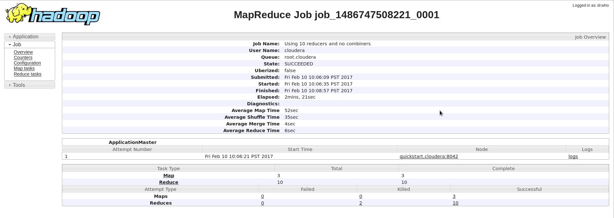
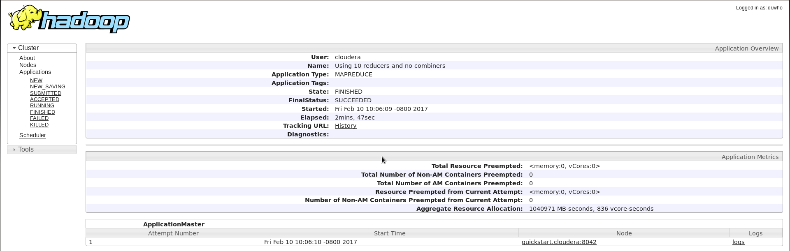

Find here the [code](/code/Ai.java) and [output](/code/results.csv).

#### ii) using a combiner:
We simply need to add the following line of code: `job.setCombinerClass(Reduce.class);`
The reported execution times are:

<b>Elapsed time: 1 min 51 sec</b><br>
<b>Average Map time: 43 sec</b><br>
<b>Average Reduce time: 2 sec</b><br>

Here are the associated screeshots:
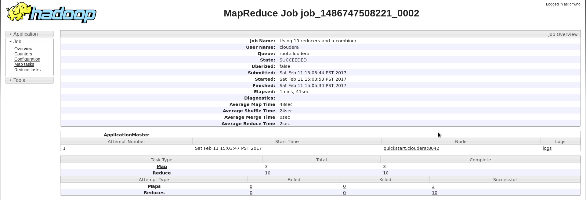
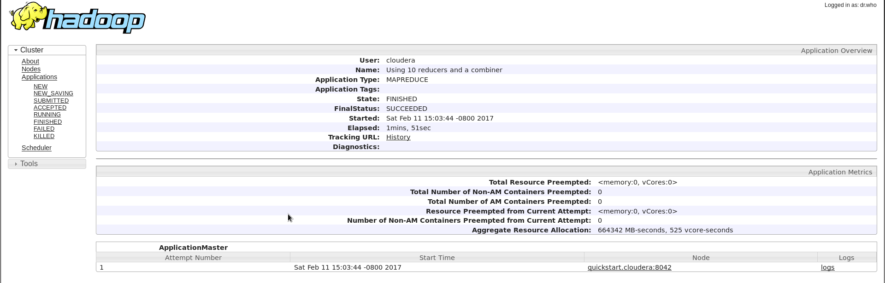

Find here the [code](/code/Aii.java) and [output](/code/results_ii.csv).

#### iii) Compressing the intermediate result of Map:
We can use any of the codecs included in Hadoop:

| Compression Format    | Hadoop Compression Codec|
|:----------:|:------------------------------------------:|
| DEFLATE    | org.apache.hadoop.io.compress.DefaultCodec |
| gzip       | org.apache.hadoop.io.compress.GzipCodec    |
| bzip2      | org.apache.hadoop.io.compress.BZip2Codec   |
| LZO        | com.hadoop.compression.lzo.LzopCodec       |
| LZ4        | org.apache.hadoop.io.compress.Lz4Codec     |
| Snappy     | org.apache.hadoop.io.compress.SnappyCodec  |

Running the same programs, we can add the following lines, to change the job configuration:

```
job.getConfiguration().setBoolean("mapred.compress.map.output", true);
job.getConfiguration().setClass("mapred.map.output.compression.codec",Lz4Codec.class, CompressionCodec.class);
```
<b>Elapsed time: 1 min 41 sec</b><br>
<b>Average Map time: 39 sec</b><br>
<b>Average Reduce time: 2 sec</b><br>

Here are the associated screeshots:
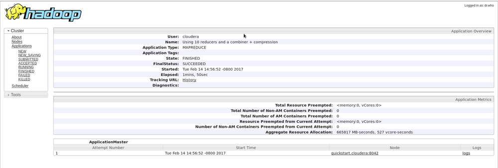
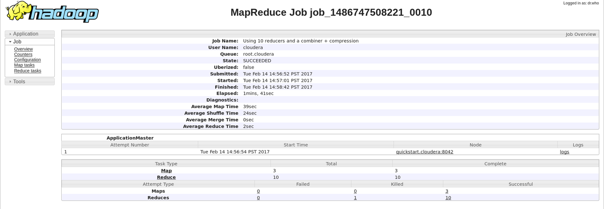

Find here the [code](/code/Aiii.java) and [output](/code/results_iii.csv).

#### iv) Using 50 reducers:
We only need to change this line: `job.setNumReduceTasks(50)` from the previous code. Here are the obtained results:

<b>Elapsed time: 4 min 57 sec</b><br>
<b>Average Map time: 26 sec</b><br>
<b>Average Reduce time: 2 sec</b><br>

Here are the associated screeshots:
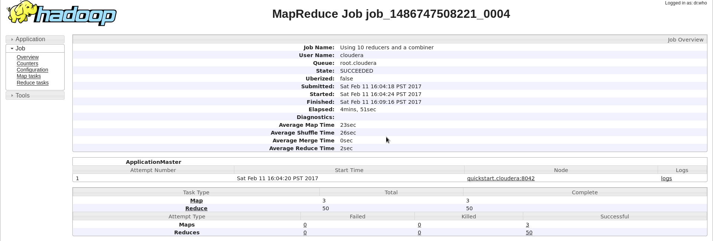
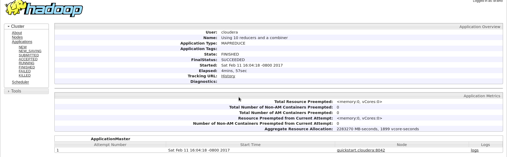

Find here the [code](/code/Aiv.java) and [output](/code/results_iv.csv).

In this case we see a large difference when comparing to the previous executions. Eventhough the average reduce time is the same, since we have 50 reducers, the total time increases.

Note that increasing the number of reducers will lead to a delay in the start of the job. Also, increasing the total number of reducers on small data sets can increase the overall time and reduce performance. 

### Question b) Implementing a simple inverted index:
An inverted index program, provides for each word in a corpus of documents, the documents where it can be found. In this case, we will implmement a simple inverted index that skips stopwords. 

We will use a small python script in order to only keep the first column of our previous csv file (only containing the skipwords and not the occurencies). 

<b>Elapsed time: 1 min 12 sec</b><br>
<b>Average Map time: 43 sec</b><br>
<b>Average Reduce time: 2 sec</b><br>

Here are the associated screeshots:
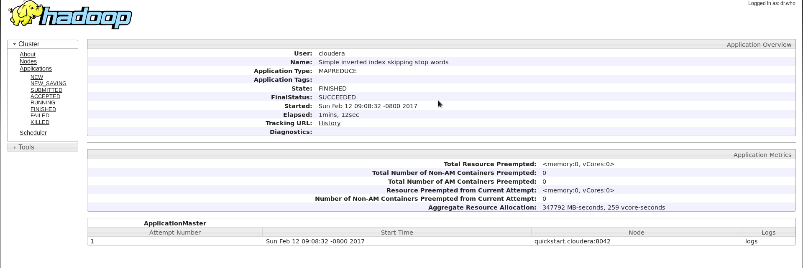
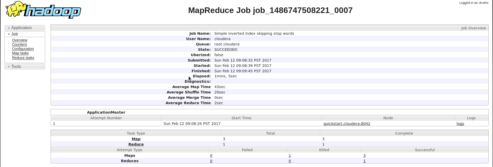

Find here the [code](/code/B.java) and [output](/code/results_b.csv).
Here is a sample of the resulting file: 
```
brigden; -> pg31100.txt
briggs, -> pg3200.txt
brigham -> pg3200.txt
brigham, -> pg3200.txt
bright -> pg3200.txt, pg100.txt
bright! -> pg100.txt
bright's -> pg3200.txt
```
### Question c) How many unique words exist in the document corpus (excluding stop words) ?  Which counter(s) reveal(s) this information? Define your own counter for the number of words appearing in a single document only. What is the value of this counter? Store the final value of this counter on a new file on HDFS.

We can aleardy say that we need a condition to select unique words in the reduce function. We will also add 3 counters in the reduce function in order to keep track of occurences. 

We can count the number of unique words by opening the hadoop output log and see the values for the counters. Three types of counters were created:

```
edu.stanford.cs246.invertedindex.C$compteur
	UniqueWords=154604
edu.stanford.cs246.invertedindex.C$compteur2
	words_in_more_than_one_doc=40656
edu.stanford.cs246.invertedindex.C$compteur3
	all_words=195260
```
Here are the associated screeshots:
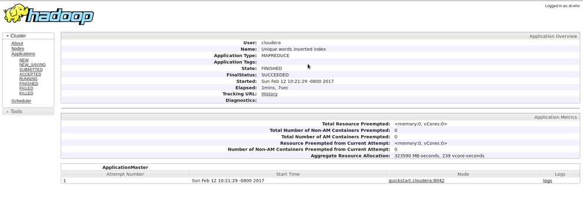
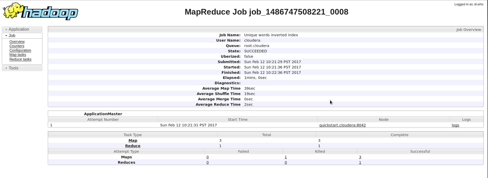

Find here the [code](/code/C.java) and [output](/code/results_c.csv).

### D) Extend the inverted index of (b), in order to keep the frequency of each word for each document. The new output should be of the form:

| Compression Format    | Hadoop Compression Codec|
|:-------:|:---------------------:|
| this    | doc1.txt#1, doc2.txt#3|
| is      | doc1.txt#3, doc2.txt#6|
| a       |doc1.txt#4, doc3.tdt#1 |
| program |doc1.txt#1, doc2.txt#3 |

Code added for Combiner:
```
job.setCombinerClass(Combiner.class);
```
Also, we create a combiner Class:
```
public static class Combiner extends Reducer<Text, Text, Text, Text> {
	      @Override
	      public void reduce(Text key, Iterable<Text> values, Context context)
	              throws IOException, InterruptedException {
	    	 HashMap<String,Integer> result = new HashMap<String,Integer>();
	         for (Text value : values) {
	        	 if(result.containsKey(value.toString())){
	        		 result.put(value.toString(), result.get(value.toString())+1); 
	        	 }
	        	 else{
	        		 result.put(value.toString(), 1) ; 
	        	 } 
	         }
	         context.write(key, new Text(result.toString().replace("=", "#").replace("}", "").replace("{", "")));
	      }
	   }
```
Here are the associated screeshots:

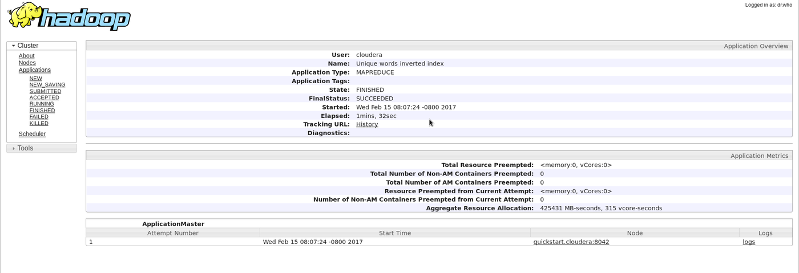

Find here the [code](/code/D.java) and [output](/code/results_D.csv).

## Sources:

<ul>
<li>http://javaarm.com/file/apache/Hadoop/books/Hadoop-The.Definitive.Guide_4.edition_a_Tom.White_April-2015.pdf</li>
<li>https://acadgild.com/blog/building-inverted-index-mapreduce/</li>
<li>http://blog.puneethabm.in/inverted-index-mapreduce-program/</li>
<li>http://arifn.web.id/blog/2012/05/15/programming-hadoop-in-eclipse.html</li>
</ul>
